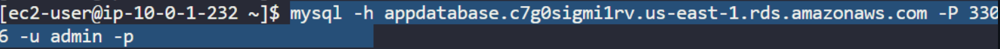

**PROJECT_OVERVIEW:**DEPLOYING AN EC2 INSTANCE WITH SHARED RELATIONAL DATABASE USING TERRAFORM.

Architecture Diagram:


**PROJECT_REQUIREMENTS**
Here are the basic requirements for the project:

### Basic Project Requirements

1. **AWS Account**: A valid AWS account with permissions to create VPCs, EC2, and RDS.

2. **Terraform**: Install Terraform (version 1.x or later).

3. **CIDR Blocks**: Define CIDR blocks for the VPC (e.g., `10.0.0.0/16`) and subnets (e.g., `10.0.1.0/24` for public, `10.0.2.0/24` for private).

4. **Instance Type**: Select an EC2 instance type (e.g., `t2.micro`).

5. **AMI ID**: Identify a valid AMI ID for the operating system.

Here's a structured hierarchy for creating AWS resources using Terraform, focusing on your specified components:

### Hierarchy of Resource Creation


1. **VPC**
   - `aws_vpc.main`: Create the Virtual Private Cloud (VPC).

2. **Subnets**
   - `aws_subnet.public`: Create a public subnet within the VPC.
   - `aws_subnet.private`: Create a private subnet within the VPC.

3. **Internet Gateway**
   - `aws_internet_gateway.main`: Create and attach an internet gateway to the VPC.

4. **Route Table**
   - `aws_route_table.public`: Create a route table for the public subnet.

5. **Route**
   - `aws_route`: Define a route in the route table to direct internet traffic through the internet gateway.

6. **Route Table Association**
   - `aws_route_table_association.public`: Associate the public subnet with the route table.

7. **Security Groups**
   - `aws_security_group.ec2_sg`: Create a security group for EC2 instances.
   - `aws_security_group.rds_sg`: Create a security group for the RDS instance.

8. **Elastic Network Interface (ENI)**
   - `aws_network_interface.app_eni`: Create an Elastic Network Interface in the public subnet.

9. **Elastic IP**
   - `aws_eip.app_eip`: Allocate an Elastic IP to be attached to the ENI.

10. **EC2 Instance**
    - `aws_instance.app`: Create the EC2 instance using the ENI.

11. **DB Subnet Group**
    - `aws_db_subnet_group.main`: Create a DB subnet group that includes the private subnet for the RDS instance.

12. **RDS Instance**
    - `aws_db_instance.main`: Create the RDS instance, specifying the DB subnet group and security group.


Explanation of each resource in our AWS architecture, highlighting the "WHY," providing examples, and explaining how these services correlate with one another:

### AWS Resource Descriptions with Correlations

1. **VPC (`aws_vpc`)**
   - **WHY**: A VPC provides an isolated network environment for your AWS resources, allowing control over IP address ranges, subnets, and security.
   - **Example**: Separate VPCs for production and development to enhance security.
   - **Correlation**: All other resources (subnets, EC2 instances, RDS) exist within this VPC, enabling them to communicate securely and effectively.

2. **Public Subnet (`aws_subnet.public`)**
   - **WHY**: Hosts resources requiring direct internet access, such as web servers or load balancers.
   - **Example**: Deploying a front-end application here for user access.
   - **Correlation**: The public subnet uses the internet gateway for external communication, allowing EC2 instances within it to serve web traffic.

3. **Private Subnet (`aws_subnet.private`)**
   - **WHY**: Hosts resources that do not require direct internet access, enhancing security.
   - **Example**: A database server that needs protection from internet exposure.
   - **Correlation**: This subnet can communicate with the public subnet (e.g., EC2 instances) but is not accessible from the internet, protecting sensitive data.

4. **Internet Gateway (`aws_internet_gateway`)**
   - **WHY**: Facilitates communication between your VPC and the internet, enabling resources in public subnets to access the internet.
   - **Example**: Users can access a web application hosted on an EC2 instance in the public subnet.
   - **Correlation**: It connects the VPC to the internet, allowing traffic routing to and from the public subnet.

5. **Route Table (`aws_route_table.public`)**
   - **WHY**: Determines how traffic is routed within the VPC.
   - **Example**: Directing internet-bound traffic to the internet gateway.
   - **Correlation**: This table is crucial for ensuring that resources in the public subnet can reach the internet and that incoming traffic can find its way back.

6. **Route (`aws_route`)**
   - **WHY**: Defines how outbound traffic is managed, directing it through the internet gateway.
   - **Example**: Setting a route for all traffic (0.0.0.0/0) to go to the internet gateway.
   - **Correlation**: Works in tandem with the route table to ensure proper traffic flow from the public subnet to the internet.

7. **Route Table Association (`aws_route_table_association.public`)**
   - **WHY**: Associates a subnet with a specific route table to determine how its traffic is routed.
   - **Example**: Linking the public subnet to the public route table for internet access.
   - **Correlation**: Ensures that the public subnet’s instances can utilize the defined routes for outbound and inbound traffic.

8. **EC2 Security Group (`aws_security_group.ec2_sg`)**
   - **WHY**: Acts as a virtual firewall for EC2 instances, controlling traffic based on specified rules.
   - **Example**: Allowing HTTP and HTTPS traffic to your web server.
   - **Correlation**: Works with the public subnet to ensure that only authorized traffic can reach your EC2 instances, protecting them from malicious access.

9. **RDS Security Group (`aws_security_group.rds_sg`)**
   - **WHY**: Controls access to the RDS instance, ensuring that only authorized resources can connect.
   - **Example**: Allowing inbound traffic from the EC2 security group.
   - **Correlation**: It collaborates with the EC2 security group to allow application servers to communicate securely with the database.

10. **Elastic Network Interface (ENI) (`aws_network_interface.app_eni`)**
    - **WHY**: Provides additional network interfaces for EC2 instances, allowing for complex configurations.
    - **Example**: Assigning both a public and private IP to a single EC2 instance.
    - **Correlation**: Enhances the networking capabilities of EC2 instances by allowing flexible IP configurations and network traffic management.

11. **Elastic IP (`aws_eip.app_eip`)**
    - **WHY**: A static public IP address that remains constant even if the associated EC2 instance stops and starts.
    - **Example**: Ensuring that a web server always has the same IP for DNS resolution.
    - **Correlation**: The Elastic IP is associated with the ENI of the EC2 instance, enabling a stable endpoint for external traffic.

12. **EC2 Instance (`aws_instance.app`)**
    - **WHY**: Provides the compute power to run applications and process requests.
    - **Example**: Hosting a web application that users access.
    - **Correlation**: Interacts with the RDS instance for data storage and retrieval, and is protected by security groups that control its network traffic.

13. **DB Subnet Group (`aws_db_subnet_group`)**
    - **WHY**: Defines which subnets the RDS instance can use, ensuring it resides within your VPC for security.
    - **Example**: Including only private subnets to enhance database security.
    - **Correlation**: Works with RDS to determine where the database can be deployed, ensuring it operates within secure, non-public subnets.

14. **RDS Instance (`aws_db_instance`)**
    - **WHY**: Provides a managed relational database service, simplifying management tasks like backups and scaling.
    - **Example**: Storing user data for a web application.
    - **Correlation**: Connects with EC2 instances via security groups, allowing application servers to query the database securely.

### Overall Correlation

- **Networking**: The VPC, subnets, and internet gateway establish the networking foundation for your resources. Security groups control access within this network.
- **Communication**: EC2 instances and RDS communicate over the private network, while public-facing resources interact with the internet through the public subnet and internet gateway.
- **Security**: Security groups provide layers of protection, ensuring only authorized traffic can reach your instances and databases.
- **Management**: Resources like Elastic IPs and ENIs enhance network management and flexibility, while the DB subnet group ensures that RDS operates securely within the private subnet environment.

To create an SSH key pair using the AWS CLI, you can use the `create-key-pair` command. Here’s a step-by-step guide on how to do it:

### Step 1: Install AWS CLI

Make sure you have the AWS CLI installed and configured with the necessary permissions.

### Step 2: Create the Key Pair

Run the following command to create a key pair:

```bash
aws ec2 create-key-pair --key-name <KEY_PAIR_NAME> --query 'KeyMaterial' --output text > <KEY_PAIR_NAME>.pem
```

### Example

1. **Replace `<KEY_PAIR_NAME>`** with your desired key pair name. For example, if you want to create a key pair named `my-key-pair`, the command would look like this:

   ```bash
   aws ec2 create-key-pair --key-name my-key-pair --query 'KeyMaterial' --output text > my-key-pair.pem
   ```

2. **Set Permissions**: After creating the key pair, you should set the appropriate permissions for the `.pem` file:

   ```bash
   chmod 600 my-key-pair.pem
   ```
**600 means the owner i.e root in our case has read and write permission since (6=4+2(where 4 denotes read and 2 denotes write permission)) but the group and others have no permisiion and are denoted by 0 and 0 after 6.**
### Step 3: Use the Key Pair

You can now use the generated `.pem` file to connect to your EC2 instances via SSH. For example:

```bash
ssh -i my-key-pair.pem ec2-user@<EC2_PUBLIC_IP>
```

*To Connect To Database Instance we should have an RDS endpoint url and the password that we have set while creating the RDS database.*

**mysql -h <DB_endpoint> -P 3306 -u admin -p**

*eg:*
